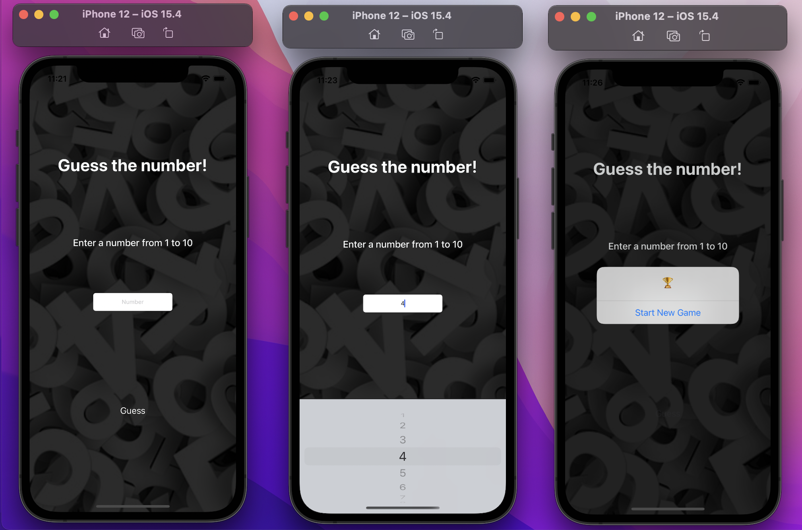

# GuessTheNumber

*There is a project similar to this one, made with HTML, CSS, and JavaScript, to visualize the click on https://github.com/VanessaTavernari/Mentalista*

This project is a game, where the user tries to guess the number that the computer has chosen.

## The project

In this project I created my canvas with storyboard. There is a label, button, text field and image.

I edited a condition to define if the number the user will choose equals the machine, so the answer could be (Yes, you're right!) or (Try again!) if not equal.

I use UIPicker View, so the user can see all numbers available options.

**Learning about: Swift, Xcode, UIKit, UIViewController, randomElement(), UIPickerView(), UIAlertController()**

## How to run
Clone this repository and open using XCode.

---
*This project was developed during the study.*
